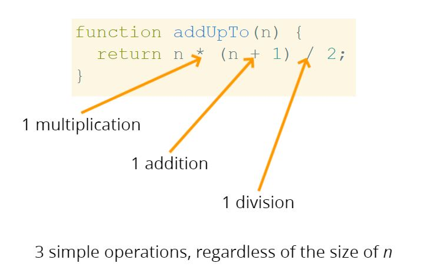
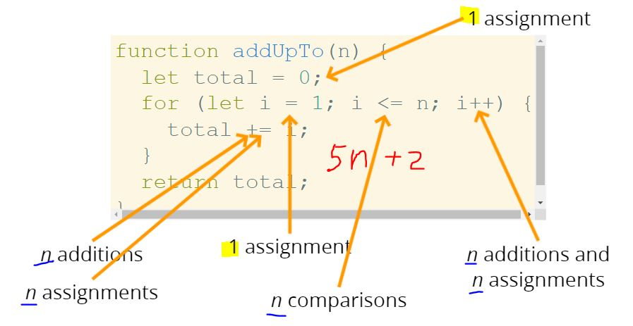
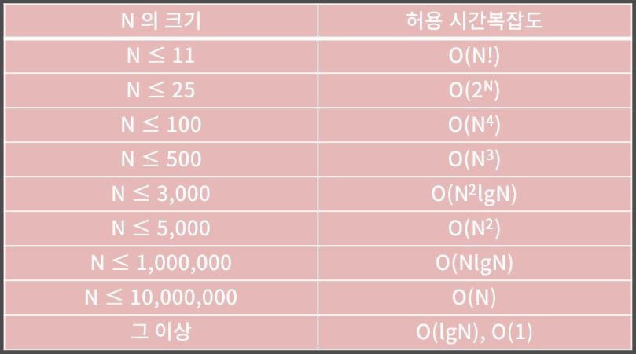

알고리즘의 성능을 어떻게 평가할 것인가?

문자열을 거꾸로 출력하는 방법에만 해도 10가지가 넘는다. 그중에서 어떤 것이 제일 좋은 방법일까?

`빅오 표기법` 은 이것을 평가하는 척도이다.

n까지 덧셈하는 알고리즘 중에서 어떤 방법이 더 좋은가?
```javascript
// 1번
function addUpTo(n) {
  let total = 0;
  for(let i = 0; i <= n; i++) {
    total += i;
  }
  return total;
}

let t1 = performance.now();
console.log(addUpTo(1000000000)); // 10억
let t2 = performance.now();
console.log(`Time Elapsed: ${(t2 - t1) / 1000} seconds.`); // 약 1.87초 
```

```javascript
// 2번
function addUpTo(n) {
  return n * (n + 1) / 2;
}

let t1 = performance.now();
console.log(addUpTo(1000000000)); // 10억
let t2 = performance.now();
console.log(`Time Elapsed: ${(t2 - t1) / 1000} seconds.`); // 약 0.0002초 
```

연산의 갯수에 따라 알고리즘의 수행 시간이 달라진다



아래 알고리즘의 연산은 총 몇번일까?



5n + 2
- n이 커질수록 추세가 커진다 (n이 절대적)

Big O 표기법
- 입력의 크기와 실행시간의 상관관계

예시


5n이든 10n이든 n으로 한다

for문 중첩하면 -> O(N^2)

상수 시간 : O(1)
- 2 + 2 나 100만 + 2 나 똑같은 1번의 연산이다
- 변수의 할당도 똑같은 1번의 연산이다
- 배열의 원소 1개에 접근하는 것 또는 객체의 1개의 필드에 접근하는 것도 1번의 연산이다

선형 시간 : O(N)
- 반복문 안에 있는 연산들은 반복문의 길이(N)에 달려있다

참고



## 공간복잡도

입력받는 데이터와 관련없이 알고리즘 그 자체의 메모리 공간 크기를 다룬다

불리언, 숫자, undefined, null -> O(1) 공간

문자열 -> O(n) 공간
- 길이가 50자인 문자열은 1자인 문자열보다 50배 더 많은 공간을 차지한다
배열, 객체 -> O(n) 공간
- n은 배열의 길이이거나 키값의 갯수

```javascript
function sum(arr) {
  let total = 0; // O(1)
  for(let i = 0; i < arr.length; i++) { // O(1)
    total += arr[i]; // 메모리 안따짐
  }
  return total;
}
// 총 공간복잡도: O(1)
```

```javascript
function double(arr) {
  let newArr = [];
  for (let i = 0; i < arr.length; i++) {
    newArr.push(2 * arr[i]);
  }
  return newArr;
}
// 전체적으로 주어진 배열의 길이에 따라 메모리공간이 결정되므로
// O(N)의 공간복잡도
```

## 로그의 개념
(밑이 2인)log8 = 3은, 2의 몇승의 값이 8이 되는가를 뜻한다.

빅오 표기법에서 밑이 2인 로그는 그냥 log로 표현한다 (밑이 2이면 생략 가능)

O(log n) 은 O(1)과 비슷한 아주 완만한 기울기를 보인다.

`log n` 은 n = 2~3 일때 1, n=4~7일때 2 의 값을 대략 가진다고 생각하면 편하다.

